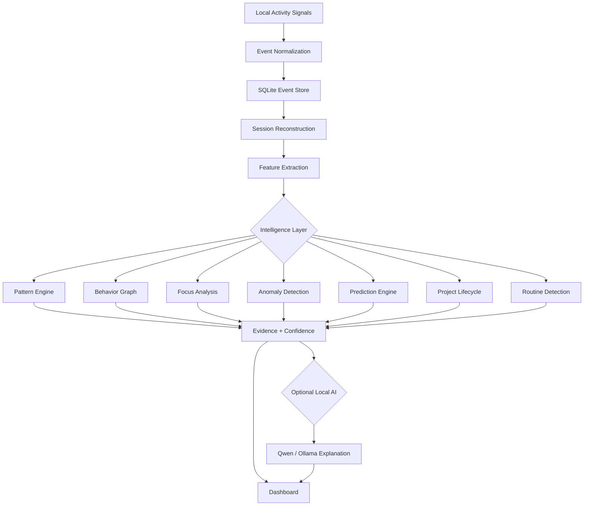

<div align="center">

# <span style="color:#55D6FF">Pattern</span><span style="color:#8B5CF6">Seeker</span>

### <span style="color:#8B5CF6">Personal Behavior Intelligence</span> · <span style="color:#55D6FF">Local-First AI</span> · <span style="color:#22C55E">Privacy by Design</span>

<p><b>Understand how you work by turning local activity signals into evidence-backed patterns, focus insights, anomaly detection and historical forecasts.</b></p>


<br/>

**Open-source • Local-first • Metadata-first • Educational project**

</div>

---

## 01 · What Is PatternSeeker?

**PatternSeeker** is a local-first Personal Behavior Intelligence system that observes privacy-filtered activity metadata from a computer and converts it into measurable behavioral intelligence.

It is designed around one principle:

> **Collect signals → normalize events → reconstruct sessions → measure evidence → discover patterns → explain results.**

PatternSeeker is intentionally **not** a traditional habit tracker. Instead of asking the user to manually record habits, it builds a behavioral picture from signals such as active applications, project activity, Git activity, screen-context categories, hardware telemetry and time-based activity.

The system separates **deterministic analytics** from optional AI interpretation. The analytics engine produces the evidence first; local AI can then help explain already-observed evidence.

---

## 02 · What Does It Do?

### Core Intelligence

| Module | What it does |
|---|---|
| **Pattern Engine** | Detects repeated activity structures and stores evidence-backed patterns. |
| **Behavior Graph** | Builds weighted relationships between applications, projects and activity categories. |
| **Focus Analysis** | Measures sessions, deep-work periods, context switching and an interpretable focus score. |
| **Prediction Engine** | Produces historical recurrence estimates using weekday/hour behavior. |
| **Pattern Forecast** | Keeps emerging patterns as candidates until sufficient evidence accumulates. |
| **Anomaly Detection** | Uses a robust median/MAD baseline to surface unusual activity days. |
| **Daily Brief** | Summarizes recent activity, tracked time and important signals. |
| **Routine Detection** | Finds recurring time/activity windows from historical observations. |
| **Project Lifecycle** | Tracks project activity, commits, file events and lifecycle phase. |
| **Context Switch Analytics** | Measures transitions between applications and workflow fragmentation. |
| **Data Quality** | Reports collection coverage, active days, gaps and event volume. |
| **Local Search** | Searches stored activity metadata without indexing raw OCR or raw screen pixels. |

### Device & Activity Intelligence

- Foreground application detection
- Application session reconstruction
- Application duration and switching
- Project discovery
- File activity metadata
- Git commit metadata
- CPU, RAM and disk telemetry
- Disk/network throughput
- Battery and uptime information
- Top process resource usage
- Optional hardware sensor integration
- Screen-context classification
- Local OCR with Tesseract
- Optional local vision analysis with Qwen2.5-VL through Ollama

---

# 03 · Real-World Impact

PatternSeeker can be used as a **personal observability and behavioral research platform**.

### For Developers

Understand questions such as:

- Which applications dominate development sessions?
- Which projects receive sustained attention?
- How often does context switching occur?
- When are development sessions most concentrated?
- Which projects are becoming dormant?

### For Students

It can help study:

- recurring study windows
- learning/application patterns
- session duration
- interruptions
- consistency of activity collection

### For Researchers / Educators

PatternSeeker provides a practical foundation for experimenting with:

- temporal behavior modelling
- event-stream analytics
- anomaly detection
- graph-based behavior modelling
- recurrence analysis
- local AI interpretation
- privacy-preserving telemetry

### Important

PatternSeeker should be treated as an **observability and analysis tool**, not as a medical, psychological, employment or surveillance decision system. Its outputs are measurements and historical estimates derived from the signals it receives; they are not definitive statements about a person's intentions or mental state.

---

# 04 · How It Works

## High-Level Pipeline

```text
┌─────────────────────────────────────────────────────────────┐
│                       USER'S DEVICES                        │
│                                                             │
│  Windows Collector       Android App       Future Sources   │
│  Apps / Projects         Heartbeat         Calendar / GitHub│
└──────────────────────────────┬──────────────────────────────┘
                               │
                               ▼
┌─────────────────────────────────────────────────────────────┐
│                     EVENT INGESTION API                     │
│                         FastAPI                              │
│                                                             │
│       Validation → Authentication → Normalization           │
└──────────────────────────────┬──────────────────────────────┘
                               │
                               ▼
┌─────────────────────────────────────────────────────────────┐
│                         DATABASE                            │
│                         SQLite                              │
│                                                             │
│       Devices · Events · Patterns · Evidence                │
└──────────────────────────────┬──────────────────────────────┘
                               │
                               ▼
┌─────────────────────────────────────────────────────────────┐
│                    INTELLIGENCE ENGINE                      │
│                                                             │
│ Sessions → Focus → Graph → Patterns → Anomalies → Forecasts │
│             → Project Lifecycle → Routines                  │
└──────────────────────────────┬──────────────────────────────┘
                               │
                               ▼
┌─────────────────────────────────────────────────────────────┐
│                     LOCAL AI LAYER                          │
│                                                             │
│      Optional Ollama / Qwen explanation & vision            │
│      AI interprets validated evidence; it does not          │
│      replace deterministic event analysis.                  │
└──────────────────────────────┬──────────────────────────────┘
                               │
                               ▼
┌─────────────────────────────────────────────────────────────┐
│                    REACT DASHBOARD                          │
│                                                             │
│ Overview · Timeline · Apps · Projects · Patterns            │
│ Behavior Graph · Focus · Predictions · Anomalies             │
│ Pattern Forecast · System · Data Quality · Search            │
└─────────────────────────────────────────────────────────────┘
```

## Intelligence Logic



---

# 05 · Pattern Production / Prediction Logic

PatternSeeker does not simply label every repeated event as a pattern.

### Pattern Lifecycle

```text
Raw Event
   ↓
Session / Feature
   ↓
Repeated Observation
   ↓
Pattern Candidate
   ↓
Evidence Accumulation
   ↓
Confidence Calculation
   ↓
Durable Pattern
```

### Historical Prediction

Predictions are descriptive historical estimates based on observed weekday/hour recurrence.

```text
Historical Events
       ↓
Weekday + Hour Bucketing
       ↓
Support Count
       ↓
Dominance
       ↓
Recency Weight
       ↓
Confidence
       ↓
Historical Forecast
```

The system deliberately avoids presenting historical recurrence as certainty.

### Anomaly Detection

```text
Daily Event Volume
       ↓
Median Baseline
       ↓
MAD (Median Absolute Deviation)
       ↓
Robust Deviation
       ↓
Potential Anomaly
```

This makes the anomaly layer less sensitive to individual extreme values than a simple mean-based threshold.

---

# 06 · Technology Stack

## Backend

- **Python** — core backend and analytics
- **FastAPI** — REST API
- **Uvicorn** — ASGI server
- **SQLAlchemy** — database ORM
- **Pydantic Settings** — configuration
- **SQLite** — local database
- **HTTPX** — local/API communication
- **python-dotenv** — environment configuration

## Desktop Intelligence

- **Python**
- **psutil** — process/system telemetry
- **mss** — in-memory screen capture
- **Pillow** — image processing
- **pytesseract** — local OCR
- **Tesseract OCR 5.x** — OCR engine
- **PowerShell/CIM** — optional hardware sensor access
- **Ollama** — local AI runtime
- **Qwen2.5-VL** — optional local screen understanding

## Frontend

- **React 19**
- **React DOM**
- **Vite 7**
- CSS-based glassmorphism / observatory interface
- Responsive dashboard architecture

## Mobile

- **Flutter / Dart**
- Android base collector with privacy-safe heartbeat architecture

## DevOps

- Docker
- Docker Compose
- PowerShell startup scripts
- Git / GitHub

---

# 07 · Project Structure

```text
PatternSeeker/
│
├── backend/
│   ├── app/
│   │   ├── api/
│   │   │   ├── advanced.py
│   │   │   ├── analytics.py
│   │   │   ├── devices.py
│   │   │   ├── events.py
│   │   │   ├── intelligence.py
│   │   │   ├── prediction.py
│   │   │   ├── projects.py
│   │   │   └── ...
│   │   ├── services/
│   │   │   ├── pattern_engine.py
│   │   │   ├── intelligence.py
│   │   │   ├── prediction_engine.py
│   │   │   ├── advanced.py
│   │   │   └── ollama.py
│   │   ├── core/
│   │   ├── models.py
│   │   ├── schemas.py
│   │   ├── db.py
│   │   └── main.py
│   ├── requirements.txt
│   └── Dockerfile
│
├── apps/
│   └── desktop/
│       ├── main.py
│       ├── hardware.py
│       ├── screen_intelligence.py
│       ├── requirements.txt
│       └── .env.example
│
├── web/
│   ├── src/
│   │   ├── main.jsx
│   │   └── styles.css
│   ├── package.json
│   ├── index.html
│   └── vite.config.js
│
├── mobile/
│   ├── lib/main.dart
│   ├── pubspec.yaml
│   └── README.md
│
├── docs/
│   ├── architecture.md
│   └── privacy.md
│
├── scripts/
│   ├── run_backend.ps1
│   ├── run_desktop.ps1
│   └── run_web.ps1
│
├── docker-compose.yml
├── start.bat
└── README.md
```

---

# 08 · Installation Guide — Windows

## Prerequisites

Install:

- Git
- Python 3.11+
- Node.js + npm
- Tesseract OCR 5.x
- Ollama (optional, required only for local AI features)
- Flutter SDK (optional, only for Android development)

## Step 1 — Clone the Repository

```bash
git clone https://github.com/<YOUR_USERNAME>/PatternSeeker.git
cd PatternSeeker
```

Replace `<YOUR_USERNAME>` with the GitHub account that hosts your fork/repository.

## Step 2 — Create the Backend Environment

```cmd
cd backend
python -m venv .venv
.venv\Scripts\activate
```

Upgrade pip:

```cmd
python -m pip install --upgrade pip
```

Install backend dependencies:

```cmd
python -m pip install -r requirements.txt
```

## Step 3 — Configure Backend

```cmd
copy .env.example .env
```

For local development, the default SQLite configuration is sufficient.

Important settings:

```env
DATABASE_URL=sqlite:///./pattern.db
CORS_ORIGINS=http://localhost:5173
INGEST_API_KEY=change-me
OLLAMA_ENABLED=false
OLLAMA_URL=http://127.0.0.1:11434
```

For a public deployment, **do not keep development secrets** such as `change-me`.

## Step 4 — Install Desktop Collector Dependencies

Open a new terminal:

```cmd
cd PatternSeeker\apps\desktop
python -m pip install -r requirements.txt
```

## Step 5 — Install Tesseract OCR

Install Tesseract OCR for Windows and verify:

```cmd
tesseract --version
```

If Windows cannot find the command, add the Tesseract installation directory to PATH, commonly:

```text
C:\Program Files\Tesseract-OCR
```

## Step 6 — Configure Desktop Collector

```cmd
cd PatternSeeker\apps\desktop
copy .env.example .env
```

Example local configuration:

```env
PATTERN_API=http://127.0.0.1:8000
PATTERN_KEY=change-me
DEVICE_ID=windows-main
DEVICE_NAME=My Windows PC

POLL_SECONDS=15
PROJECT_SCAN_SECONDS=300
FILE_SCAN_SECONDS=180
GIT_SCAN_SECONDS=300
SYSTEM_POLL_SECONDS=15

PROJECT_ROOTS=C:\Users\YourName\Desktop;C:\Users\YourName\Documents;C:\Users\YourName\Projects
AUTO_DISCOVER=true
MAX_DEPTH=5

SCREEN_INTELLIGENCE_ENABLED=true
SCREEN_INTELLIGENCE_INTERVAL=60
SCREEN_OCR_ENABLED=true

# Start with false. Enable after validating local performance.
SCREEN_AI_ENABLED=false
SCREEN_AI_MODEL=qwen2.5vl:7b
OLLAMA_URL=http://127.0.0.1:11434

SCREEN_SAVE_IMAGES=false
SCREEN_SEND_TO_API=false
```

## Step 7 — Install Local Vision AI (Optional)

Install Ollama, then:

```cmd
ollama pull qwen2.5vl:7b
```

Verify:

```cmd
ollama list
```

Then set:

```env
SCREEN_AI_ENABLED=true
SCREEN_AI_MODEL=qwen2.5vl:7b
OLLAMA_URL=http://127.0.0.1:11434
```

PatternSeeker includes adaptive safeguards such as cooldowns and system-resource thresholds for local vision inference.

## Step 8 — Install Frontend Dependencies

Open another terminal:

```cmd
cd PatternSeeker\web
npm install
```

## Step 9 — Start the Backend

```cmd
cd PatternSeeker\backend
.venv\Scripts\activate
python -m uvicorn app.main:app --host 127.0.0.1 --port 8000 --reload
```

Backend:

```text
http://127.0.0.1:8000
```

API documentation:

```text
http://127.0.0.1:8000/docs
```

## Step 10 — Start the Desktop Collector

```cmd
cd PatternSeeker\apps\desktop
python main.py
```

## Step 11 — Start the Web Dashboard

```cmd
cd PatternSeeker\web
npm run dev
```

Open the Vite URL shown in the terminal, normally:

```text
http://localhost:5173
```

## Step 12 — One-Click Windows Launcher

The repository also contains:

```text
start.bat
```

It is intended to orchestrate the local backend, desktop collector and dashboard. If you prefer manual control, use the three terminal commands above.

---

# 09 · Docker Setup

The repository includes `docker-compose.yml` for the backend API.

```cmd
docker compose up --build
```

The API is exposed on:

```text
http://127.0.0.1:8000
```

The default Docker configuration uses a persistent Docker volume for SQLite data.

The desktop collector and web dashboard can still be run locally when developing the complete system.

---

# 10 · API Surface

PatternSeeker exposes REST endpoints for:

### Core

```text
GET  /api/health
GET  /api/devices
POST /api/devices
GET  /api/events/recent
POST /api/events
POST /api/events/batch
```

### Analytics

```text
GET  /api/analytics/summary
GET  /api/analytics/timeline
GET  /api/analytics/app-usage
GET  /api/analytics/intelligence
GET  /api/analytics/system
GET  /api/analytics/health-intelligence
GET  /api/analytics/telemetry-history
GET  /api/analytics/performance
GET  /api/analytics/screen-intelligence
POST /api/analytics/detect
```

### Intelligence

```text
GET /api/intelligence/behavior-graph
GET /api/intelligence/focus
GET /api/intelligence/predictions
GET /api/intelligence/anomalies
```

### Predictive Intelligence

```text
GET /api/prediction/forecast
GET /api/prediction/pattern-candidates
GET /api/prediction/daily
GET /api/prediction/pattern-forecast
```

### Advanced Intelligence

```text
GET /api/advanced/daily-brief
GET /api/advanced/routines
GET /api/advanced/project-lifecycle
GET /api/advanced/context-switches
GET /api/advanced/data-quality
GET /api/advanced/search
```

---

# 11 · Privacy & Security Model

PatternSeeker follows a **metadata-first, local-first** design.

### Intentionally Not Collected

```text
❌ Keystrokes
❌ Passwords
❌ Clipboard contents
❌ Browser cookies
❌ Microphone streams
❌ Camera streams
❌ Full file contents
❌ Raw screenshots persisted to the database
❌ Raw OCR text persisted to the database
```

### Screen Intelligence

Screen Intelligence is not designed as a permanent screen recorder.

```text
Screen
  ↓
Temporary in-memory frame
  ↓
OCR / optional local vision model
  ↓
High-level activity category
  ↓
Structured event
  ↓
Frame discarded
```

Sensitive-window detection can pause analysis for configured terms associated with banking, password managers, OTP/authenticator tools, payment applications, private browsing and login screens.

### API Security

Event ingestion uses an API key header during development:

```text
X-Pattern-Key
```

Before exposing the API beyond localhost, replace development credentials and add a production authentication strategy.

---

# 12 · Performance Philosophy

PatternSeeker is designed to remain a **background observer**, not a resource-hungry monitoring process.

The Windows collector uses:

- below-normal process priority
- throttled project scans
- throttled filesystem scans
- throttled Git scans
- adaptive screen AI
- OCR fallback
- context-change-aware vision inference
- CPU and memory guardrails
- normalized process CPU calculations
- exclusion of Windows pseudo-processes such as `System Idle Process`

The goal is to collect useful signals while keeping the user's normal workflow responsive.

---

# 13 · Open-Source Development

Contributions are welcome.

Recommended contribution flow:

```bash
git clone https://github.com/<YOUR_USERNAME>/PatternSeeker.git
cd PatternSeeker
git checkout -b feature/your-feature
```

Make your changes, test locally, then:

```bash
git add .
git commit -m "feat: describe your change"
git push origin feature/your-feature
```

When contributing, please preserve the project's privacy principles:

1. Do not introduce credential collection.
2. Do not add hidden telemetry.
3. Do not persist raw screenshots without explicit design approval.
4. Keep collectors opt-in where sensitive permissions are required.
5. Prefer deterministic evidence before AI interpretation.
6. Document new data sources and retention behavior.

---

# 14 · Author

<div align="center">

## <span style="color:#55D6FF">Manish Kuntal</span>

**Computer Science & Engineering Student · Developer · Builder**

PatternSeeker is developed as an open-source engineering and learning project exploring:

`Personal Analytics` · `AI Systems` · `Privacy Engineering` · `Data Engineering` · `Behavior Modelling`

</div>

---

# 15 · Educational Use Only

> **PatternSeeker is provided for educational, research and personal experimentation purposes.**

Use it only on systems and data for which you have appropriate authorization. Do not deploy it to monitor another person's device, account or activity without informed permission and applicable legal authorization.

The project is intended to demonstrate software engineering concepts including telemetry collection, event processing, analytics, anomaly detection, graph modelling, historical prediction and local AI integration.

---

# 16 · Roadmap

```text
[✓] Local event ingestion
[✓] Windows application intelligence
[✓] Project + Git intelligence
[✓] Hardware telemetry
[✓] Screen Intelligence architecture
[✓] Local OCR
[✓] Optional local Qwen vision
[✓] Pattern Engine
[✓] Behavior Graph
[✓] Focus Analysis
[✓] Historical Predictions
[✓] Anomaly Detection
[✓] Pattern Candidates / Forecast
[✓] Daily Brief
[✓] Routine Detection
[✓] Project Lifecycle Intelligence
[✓] Context Switch Analytics
[✓] Data Quality
[✓] Local Metadata Search
[✓] Polished React dashboard

[ ] Android UsageStats integration
[ ] Calendar integration
[ ] GitHub integration
[ ] Browser metadata connector
[ ] PostgreSQL production mode
[ ] Encrypted remote synchronization
[ ] Production authentication
[ ] Background worker architecture
```

---

# 17 · Final Architecture

```text
                    ┌──────────────────────┐
                    │      WINDOWS PC      │
                    └──────────┬───────────┘
                               │
             ┌─────────────────┼─────────────────┐
             │                 │                 │
             ▼                 ▼                 ▼
        Applications       Projects/Git      Hardware
             │                 │                 │
             └─────────────────┼─────────────────┘
                               │
                               ▼
                     ┌─────────────────┐
                     │ Screen Context  │
                     │ OCR + Vision    │
                     └────────┬────────┘
                              │
                              ▼
                     ┌─────────────────┐
                     │  Event API      │
                     │    FastAPI      │
                     └────────┬────────┘
                              │
                              ▼
                     ┌─────────────────┐
                     │ SQLite Event DB  │
                     └────────┬────────┘
                              │
                              ▼
                  ┌─────────────────────────┐
                  │ Session + Feature Layer │
                  └────────────┬────────────┘
                               │
        ┌──────────────────────┼──────────────────────┐
        ▼                      ▼                      ▼
  Pattern Engine        Behavior Graph        Focus Analysis
        │                      │                      │
        ├──────────────┬───────┴──────────────┬──────┤
        ▼              ▼                      ▼      ▼
   Predictions      Anomalies             Routines Lifecycle
        │              │                      │      │
        └──────────────┴──────────┬───────────┴──────┘
                                  ▼
                         Evidence / Confidence
                                  │
                                  ▼
                         Optional Local AI
                           Ollama + Qwen
                                  │
                                  ▼
                         React / Vite UI
```

---

<div align="center">

### <span style="color:#55D6FF">PatternSeeker</span>

**Observe less. Understand more. Keep the data local.**

<sub>Built for learning, experimentation and privacy-conscious personal analytics.</sub>

</div>
